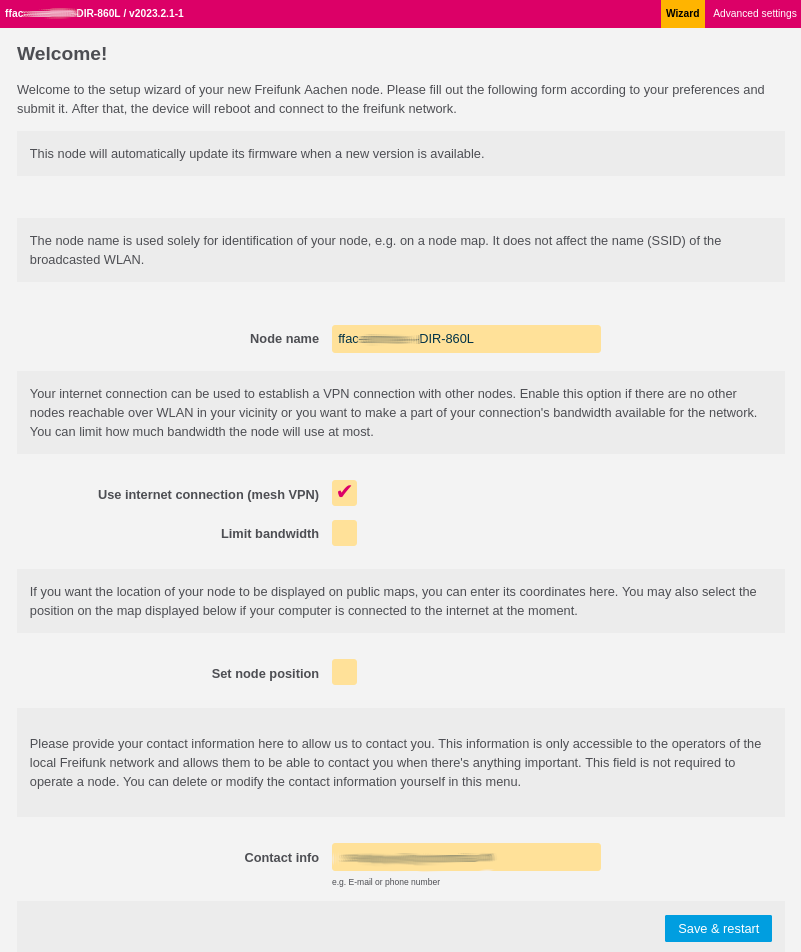

Config Mode
===========

When in Config Mode a node will neither participate in the mesh nor connect
to the VPN using the WAN port. Instead, it'll offer a web interface on the
LAN port to aid configuration of the node.

Whether a node is in Config Mode can be determined by a characteristic
blinking sequence of the SYS LED:

.. image:: node_configmode.gif

Activating Config Mode
----------------------

Config Mode is automatically entered at the first boot. You can re-enter
Config Mode by pressing and holding the RESET/WPS/DECT button for about three
seconds. The device should reboot (all LEDs will turn off briefly) and
Config Mode will be available.

If you have access to the console of the node, there is the
``gluon-enter-setup-mode`` command, which reboots a node into Config Mode.

Port Configuration
------------------

In general, Config Mode will be offered on the LAN ports. However, there
are two practical exceptions:

* Devices with just one network port will run Config Mode on that port.
* Devices with PoE on the WAN port will run Config Mode on the WAN port instead.

Accessing Config Mode
---------------------

Config Mode can be accessed at http://192.168.1.1. The node will offer DHCP
to clients. Should this fail, you may assign an IP from 192.168.1.0/24 to
your computer manually.

Advanced Config Options
-----------------------

Depending on the installed packages, the advanced config mode allows to configure packages further.

* :doc:`gluon-web-wifi-config enable <wlan-configuration>` radios used for wifi and mesh as well as outdoor mode
* :doc:`../package/gluon-web-network` allows to configure the used roles (uplink, mesh, client) on each interface
* :doc:`../package/gluon-web-admin` allows to enter SSH keys or set a password in the `Remote access` section
* :doc:`../package/gluon-web-cellular` allows to configure SIM card / WWAN settings on supported cellular devices

The advanced config does also allow to upload a sysupgrade file to update the firmware to a different version.
