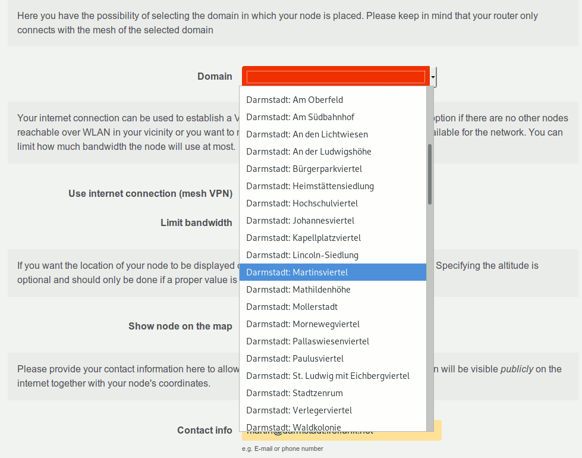

Multidomain Support
===================

Preamble
--------

There comes a time when a mesh network grows past sensible boundaries.
As broadcast traffic grows, mesh networks experience scaling issues and
using them becomes very unpleasant. An approach to solve this follows
the well-known “divide and conquer” paradigm and splits a large network
into multiple smaller networks. These smaller networks start with a
dedicated layer 2 network each, which are interconnected via their
gateways by layer 3 routing. Gluon is already field-tested handling a
single domain and the multidomain feature allows for the reconfiguration
of key parameters that decide which domain a node participates in,
without the need of a distinct set of firmware images for each mesh domain.

Overview
--------

Multidomain support allows to build a single firmware with multiple,
switchable domain configurations. The nomenclature is as follows:

- ``site``: an aggregate over multiple domains
- ``domain``: mesh network with connectivity parameters that prevent
  accidental bridging with other domains
- ``domain code``: unique domain identifier
- ``domain name``: pretty name for a domain code

By default Gluon builds firmware with a single domain embedded into
``site.conf``. To use multiple domains, enable it in ``site.mk``:

::

  GLUON_MULTIDOMAIN=1

In the site repository, create the ``domains/`` directory, which will
hold your domain configurations. Each domain configuration file is named
after its primary ``domain_code``, additional domain codes and names are
supported.

::

  site/
  |-- site.conf
  |-- site.mk
  |-- i18n/
  |-- domains/
    |-- alpha_centauri.conf
    |-- beta_centauri.conf
    |-- gamma_centauri.conf

The domain configuration ``alpha_centauri.conf`` could look like this.

::

  {
    domain_names = {
      alpha_centauri = 'Alpha Centauri'
    },

    -- more domain specific config follows below
  }

In this example “Alpha Centauri” is the user-visible ``domain_name`` for the
domain_code ``alpha_centauri``. Also note that the domain code
``alpha_centauri`` matches the filename ``alpha_centauri.conf``.

Additional domain codes/names can be added to ``domain_names``, which
are treated as aliases for the their domain configuration. Aliases can
be used to offer more fine-grained and well-recognizable domain choices
to users. Having multiple aliases on a single domain is a helpful
precursor to splitting the domain into even smaller blocks.

Furthermore you have to specify the ``default_domain`` in the ``site.conf``.
This domain is applied in following cases:

- When the config mode is skipped.
- When a domain is removed in a new firmware release, the default_domain
  will be chosen then.
- When a user selects a wrong domain code via uci.

Please note, that this value is saved to uci, so changing the `default_domain`
value in the `site.conf` in a new firmware release only affects the actual
domain of a router, if and only if one of the above conditions matches.

Switching the domain
--------------------

Via commandline
^^^^^^^^^^^^^^^

::

  gluon-switch-domain 'newdomaincode'

When the node is not in config mode, ``gluon-switch-domain`` will automatically
reboot the node by default. This can be suppressed by passing ``--no-reboot``::

  gluon-switch-domain --no-reboot 'newdomaincode'

Switching the domain without reboot is currently **experimental**.

Via config mode
^^^^^^^^^^^^^^^

To allow switching the domain via config mode, add ``config-mode-domain-select``
to GLUON_FEATURES in site.mk.

|image0|

Allowed site variables
----------------------

Internally the site variables are merged from the ``site.conf`` and the
selected ``domain.conf``, so the most variables are also allowed in
``site.conf`` and in ``domain.conf``. But there are some exceptions,
which do not make sense in a domain or site specific way. The following
sections give an overview over variables that are only usable in either
site or domain context.

site.conf only variables
^^^^^^^^^^^^^^^^^^^^^^^^

- Used in as initial default values, when the firmware was just flashed
  and/or the config mode is skipped, so they do not make sense in a
  domain specific way:

  - authorized_keys
  - default_domain
  - poe_passthrough
  - interfaces.*.default_roles
  - setup_mode.skip
  - autoupdater.branch
  - mesh_vpn.enabled
  - mesh_vpn.pubkey_privacy
  - mesh_vpn.bandwidth_limit
  - mesh_vpn.bandwidth_limit.enabled
  - mesh_vpn.bandwidth_limit.ingress
  - mesh_vpn.bandwidth_limit.egress

- Variables that influence the appearance of the config mode,
  domain-independent because they are relevant before a domain was selected.

  - config_mode.geo_location.show_altitude
  - config_mode.hostname.optional
  - config_mode.remote_login
  - config_mode.remote_login.show_password_form
  - config_mode.remote_login.min_password_length
  - hostname_prefix
  - mesh_vpn.fastd.configurable
  - roles.default
  - roles.list

- Specific to a firmware build itself:

  - site_code
  - site_name
  - autoupdater.branches.*.name
  - autoupdater.branches.*.good_signatures
  - autoupdater.branches.*.pubkeys

- We simply do not see any reason, why these variables could be helpful
  in a domain specific way:

  - mesh_vpn.fastd.syslog_level
  - timezone
  - regdom

domain.conf only variables
^^^^^^^^^^^^^^^^^^^^^^^^^^

- Obviously:

  - domain_names

    - a table of domain codes to domain names
      ``domain_names = { foo = 'Foo Domain', bar = 'Bar Domain', baz = 'Baz Domain' }``

  - hide_domain

    - prevents a domain name(s) from appearing in config mode, either
      boolean or array of domain codes

      - ``true``, ``false``
      - ``{ 'foo', 'bar' }``

- Because each domain is considered a separate layer 2 network, these
  values should be different in each domain:

  - next_node.ip4
  - next_node.ip6
  - next_node.name
  - prefix6
  - prefix4
  - extra_prefixes6

- To prevent accidental bridging of different domains, all meshing
  technologies should be separated:

  - domain_seed (wired mesh)

    - must be a random value used to derive the vxlan id for wired meshing

  - wifi*.mesh.id
  - mesh_vpn.fastd.groups.*.peers.remotes
  - mesh_vpn.fastd.groups.*.peers.key
  - mesh_vpn.tunneldigger.brokers

- Clients consider WiFi networks sharing the same ESSID as if they were
  the same L2 network and try to reconfirm and reuse previous
  addressing. If multiple neighbouring domains shared the same ESSID,
  the roaming experience of clients would degrade.

  - wifi*.ap.ssid

- Some values should be only set in legacy domains and not in new domains.

  - mesh.vxlan

    - By default, this value is `true`. It should be only set to `false`
      for one legacy domain, since vxlan prevents accidental wired
      merges of domains. For old domains this value is still available
      to keep compatibility between all nodes in one domain.

  - next_node.mac

    - For new domains, the default value should be used, since there is
      no need for a special mac (or domain specific mac). For old domains
      this value is still available to keep compatibility between all
      nodes in one domain.

Example config
--------------

site.mk
^^^^^^^

.. literalinclude:: ../multidomain-site-example/site.mk
  :language: makefile

site.conf
^^^^^^^^^

.. literalinclude:: ../multidomain-site-example/site.conf
  :language: lua

domains/alpha_centauri.conf
^^^^^^^^^^^^^^^^^^^^^^^^^^^

.. literalinclude:: ../multidomain-site-example/domains/alpha_centauri.conf
  :language: lua

i18n/en.po
^^^^^^^^^^

.. literalinclude:: ../multidomain-site-example/i18n/en.po
  :language: po

i18n/de.po
^^^^^^^^^^

.. literalinclude:: ../multidomain-site-example/i18n/de.po
  :language: po

modules
^^^^^^^

.. literalinclude:: ../multidomain-site-example/modules
  :language: makefile

