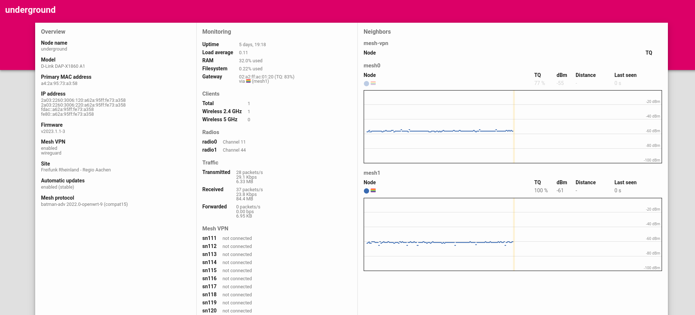

Status-Page
===========

When the feature ``gluon-status-page`` is enabled, Gluon nodes run a HTTP server with status information on all IP addresses of ``br-client``.
This makes it possible to check information of the node in realtime.

If the mesh protocol ``gluon-mesh-batman-adv`` is installed too, the package ``gluon-status-page-mesh-batman-adv`` is added too according to the :ref:`user-site-feature-flags`

.. _status-page-example-picture:

Example Picture
---------------

The left side of the status page contains Overview information.
In the middle, current monitoring information abut the system, number of clients, radios, amount of traffic and connected mesh-vpn if any are shown.
The right side of the Status-Page contains information about Neighbours to this node through :doc:`wired-mesh` as well as wireless mesh.

Mesh Graphs
-----------

When wireless mesh is enabled, the mesh interfaces show realtime Graphs about the received signal strength (RSSI) in dBm.

Neighbours
----------

The list of neighbours at first shows the mac-address of the neighbour it sees.
The status-page sends a second request to ``http://[ipv6]/cgi-bin/dyn/neighbours-nodeinfo?mesh-vpn`` which triggers the lookup of neighbour information on the node itself.
Through this, the actual nodenames of the neighbours are shown on the status-page as can be seen in the :ref:`status-page-example-picture`.
