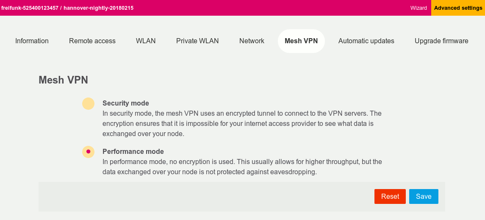

Mesh VPN
========

Gluon integrates several layer 2 tunneling protocols to
allow connections between local meshes through the internet.

Protocol handlers
^^^^^^^^^^^^^^^^^

There are currently three protocol handlers which can be selected
via ``GLUON_FEATURES`` in ``site.mk``:

mesh-vpn-fastd
""""""""""""""

fastd is a lightweight userspace tunneling daemon that
implements cipher suites that are specifically designed
to work well on embedded devices. It offers encryption
and authentication.
The primary drawback of fastd's encrypted connection modes
is the necessary context switches when forwarding packets.
A kernel-supported L2TPv3 offloading option is available to
work around the context-switching bottleneck, but it comes
at the cost of losing the ability to protect tunnel connections
against eavesdropping or manipulation.

mesh-vpn-tunneldigger
"""""""""""""""""""""

Tunneldigger always uses L2TPv3, generally achieving the same
performance as fastd with the ``null@l2tp`` method, but offering
no security.
Tunneldigger's primary drawback is the lack of IPv6 support.
It also provides less configurability than fastd.

mesh-vpn-wireguard
""""""""""""""""""

WireGuard is an encrypted in-kernel tunneling protocol that
provides encrypted transmission and at the same time offers
high throughput.

fastd
^^^^^

.. _VPN fastd methods:

Methods
"""""""

fastd offers various different connection "methods" with different
security properties that can be configured in the site configuration.

The following methods are currently recommended:

- ``salsa2012+umac``: Encrypted + authenticated
- ``null+salsa2012+umac``: Unencrypted, authenticated
- ``null@l2tp``: Unencrypted, unauthenticated

Multiple methods can be listed in ``site.conf``. The first listed method
supported by both the node and its peer will be used.

The use of the ``null@l2tp`` method with offloading enabled can provide a
considerable performance gain, especially on weaker embedded hardware.
For L2TP offloading, the ``mesh-vpn-fastd-l2tp`` feature needs to be enabled in
``site.mk``.

.. _vpn-gateway-configuration:

Gateway / Supernode Configuration
"""""""""""""""""""""""""""""""""

When only using the ``null`` or ``null@l2tp`` methods without offloading,
simply add these methods to the front of the method list. ``null@l2tp``
should always appear before ``null`` in the configuration when both are enabled.
fastd v22 or newer is needed for the ``null@l2tp`` method.

It is often not necessary to enable L2TP offloading on supernodes for
performance reasons. Nodes using offloading can communicate with supernodes that
don't use offloading as long as both use the ``null@l2tp`` method.

.. _vpn-gateway-configuration-offloading:

Offloading on Gateways / Supernodes
~~~~~~~~~~~~~~~~~~~~~~~~~~~~~~~~~~~

To enable L2TP offloading on the supornodes, it is recommended to study the
fastd documentation section pertaining to the `offload configuration option
<https://fastd.readthedocs.io/en/stable/manual/config.html#option-offload>`_.

However, the important changes to the fastd config on your Supernode are:

    - | Set ``mode multitap;``
      | Every peer gets their own interface.

    - | Replace ``interface "foo":`` with ``interface "peer-%k";``
      | ``%k`` is substituted for a portion of the peers public key.

    - | Set ``offload l2tp yes;``
      | This tells fastd to use the l2tp kernel module.

    - | Set ``persist interface no;``
      | This tells fastd to only keep interfaces around while the connection is active.

Note that in ``multitap`` mode, which is required when using L2TP offloading,
fastd will create one interface per peer on the supernode's. This allows
offloading the L2TP forwarding into the kernel space. But this also means added
complexity with regards to handling those interfaces.

There are two main options on how you can handle this:

    -  create ``on up`` and ``on down`` hooks

        - to handle interface setup and destruction
        - preferably using the async keyword, so hooks are not blocking fastd

    - use a daemon like systemd-networkd

Examples for both options can be found in the
`Wiki <https://github.com/freifunk-gluon/gluon/wiki/fastd-l2tp-offloading-on-supernodes>`_.

Configurable Method
"""""""""""""""""""

From the site configuration, fastd can be allowed to offer
toggleable encryption in the config mode with the intent to
increase throughput.

There is also an older unprotected method ``null``. Use of the newer
``null@l2tp`` method is generally recommended over ``null``, as the
performance gains provided by the latter (compared to the encrypted
and authenticated methods) are very small.

Site configuration
~~~~~~~~~~~~~~~~~~

1)
  Add the feature ``web-mesh-vpn-fastd`` in ``site.mk``
2)
  Set ``mesh_vpn.fastd.configurable = true`` in ``site.conf``
3)
  Optionally, add ``null@l2tp`` to the ``mesh_vpn.fastd.methods`` table if you want
  "Performance mode" as default (not recommended)

Config Mode
~~~~~~~~~~~

The resulting firmware will allow users to choose between secure (encrypted) and fast (unencrypted) transport.

To confirm whether the correct cipher is being used, the log output
of fastd can be checked using ``logread``.

WireGuard
^^^^^^^^^

In order to support WireGuard in Gluon, a few technologies are glued together.

**VXLAN:** As Gluon typically relies on batman-adv, the Mesh VPN has to provide
OSI Layer 2 transport. But WireGuard is an OSI Layer 3 tunneling protocol, so
additional technology is necessary here. For this, we use VXLAN. In short, VXLAN
is a well-known technology to encapsulate ethernet packages into IP packages.
You can think of it as kind of similar to VLAN, but on a different layer. Here,
we use VXLAN to transport batman-adv traffic over WireGuard.

**wgpeerselector**: To connect all gluon nodes to each other, it is common to
create a topology where each gluon node is connected to one of the available
gateways via Mesh VPN respectively. To achieve this, the gluon node should be
able to select a random gateway to connect to. But such "random selection of a
peer" is not implemented in WireGuard by default. WireGuard only knows static
peers. Therefore the *wgpeerselector* has been developed. It randomly selects a
gateway, tries to establish a connection, and if it fails, tries to connect
to the next gateway. This approach has several advantages, such as load
balancing VPN connection attempts and avoiding problems with offline gateways.
More information about the wgpeerselector and its algorithm can be found
`here <https://github.com/freifunk-gluon/packages/blob/master/net/wgpeerselector/README.md>`__.

On the gluon node both VXLAN and the wgpeerselector are well integrated and no
explicit configuration of those tools is necessary, once the general WireGuard
support has been configured.

Attention must by paid to time synchronization. As WireGuard
performs checks on timestamps in order to avoid replay attacks, time must
be synchronized before the Mesh VPN connection is established. This means that
the NTP servers specified in your site.conf must be publicly available (and not
only through the mesh). Be aware that if you fail this, you may not directly see
negative effects. Only when a previously connected node reboots the effect
comes into play, as the gateway still knows about the old timestamp of the gluon
node.

gluon-mesh-vpn-key-translate
""""""""""""""""""""""""""""

Many communities already possess a collection of active fastd-keys when they
plan migrating their community to WireGuard.
These public keys known on the server-side can be derived into their WireGuard
equivalent using `gluon-mesh-vpn-key-translate <https://github.com/AiyionPrime/gluon-mesh-vpn-key-translate>`__.
The routers do the necessary reencoding of the private key seamlessly
when updating firmware from fastd to the WireGuard variant.

Gateway / Supernode Configuration
"""""""""""""""""""""""""""""""""

On the gateway side, a software called *wireguard-vxlan-glue* is necessary. It
is a small daemon that dynamically adds and removes forwarding rules for VXLAN
interfaces, so traffic is sent correctly into the WireGuard interface. Thereby
the forwarding rules are only installed if a client is connected, so
unnecessary traffic in the kernel is avoided. The source can be found
`here <https://github.com/freifunkh/wireguard-vxlan-glue/>`__.
