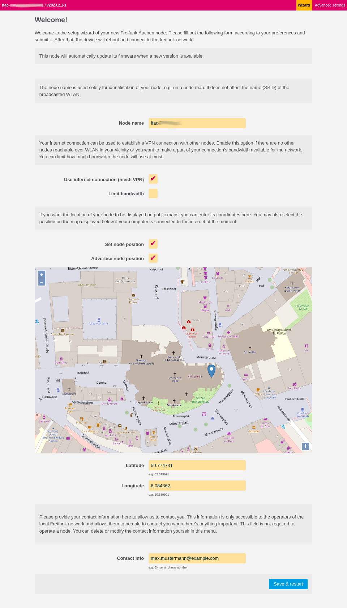

.. _package-gluon-config-mode-geo-location-osm:

gluon-config-mode-geo-location-osm
==================================

When package *gluon-config-mode-geo-location-osm* is enabled, the configuration wizard will
try to load an OSM-based map to allow the user to specify the node location.
Loading the map requires a working internet connection, for example via WLAN
(while connected to the Gluon node via Ethernet).

