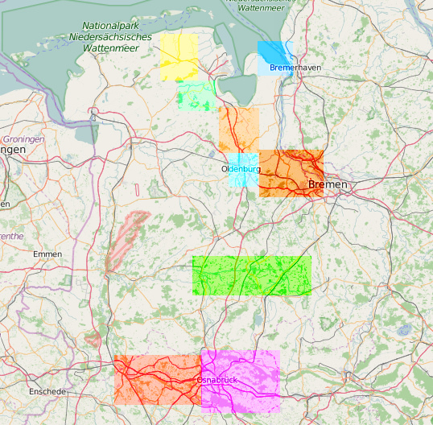
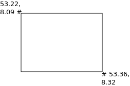

gluon-hoodselector
==================

This package provides an automated way to continuously select the correct
domain based on the geolocation of a node. The purpose of Hoodselector is to
automatically detect in which domain the node is located based on its
geolocation settings. Therefore domains are required to have bounding boxes,
defined as polygons or rectangles. Based on this information Hoodselector will
select a domain from the list of known domains and migrate towards it without
requiring a reboot. This package therefore provides a scalable and
decentralized approach to automatic domain selection.

Background information
----------------------

The main problem of the Nordwest Freifunk community was the quickly rising
number of nodes in the network. This indirectly affected the stability of the
network, because the noise inside the network, e.g. management traffic from
the batman-adv protocol, was rising, too. Inside the community there were some
ideas like building separate firmwares for each region. This solution would
cause issues with splitting regions again and nodes scattered among regions
which belong to a different region. Therefore we decided to develop a
dynamic and decentralized management of regions called domains.
The Hoodselector's task is to choose the "right" domains in an intelligent way
and to hold the network together and accessible.

A domain is defined by geostationary fixed shapes by using longitude & latitude
in combination with the domain configuration system. Below you can see a visual
example of a regional domain:

    © OpenStreetMap contributors

Behaviour
------------------

The following is an abstract state diagram which gives an overview
of the process:

.. image:: ./gluon-hoodselector.svg

The sequence of this diagram reflects the priority of its running modes.
Each mode will be explained separately below.

geolocation mode
^^^^^^^^^^^^^^^^

This mode will only be entered when a node has location coordinates set.
Nodes with a position will set their domain based on it.
The node will skip to the next mode when the node (a) has no position or
(b) its position is not within any of the defined bounding boxes.

default domain mode
^^^^^^^^^^^^^^^^^^^

This mode will be entered if no other mode before fits.
It provides a fallback to the default domain.

Domain shapes
-------------

There are two types of domains: the unique default one without a defined shape
and others which contain shapes.

* **default domain**

The default domain doesn’t hold any shapes and represents the inverted area of
all other shapes held by other domains with geo coordinates. It will only be
entered if a node could not be matched to a geo domain. A suggested approach is
to define the "old" network as default domain and gradually migrate nodes from
there to geo domains.

* **geo domains**

A geo domain contains shapes, which are described by three dimensional arrays
and represents the geographical size of the domain. There are two possible
definitions of these shapes. The first one is using rectangles so that only
two coordinates per box are needed to define it (see below for an
example). The second one uses polygons which can have multiple edges.
Each domain can hold multiple shapes.

site.conf
---------

The designer of the shapes must always ensure that no overlapping polygons
between domains will be created or else the order in the domain list will
become relevant. If for example domain A and B overlap, Hoodselector
would, for that overlapping area, only ever reach domain A, but never domain B.
Here is an example of a rectangular definition of a shape:
Example::

  hoodselector = {
    shapes = {
      {
        {
          lat = 53.128,
          lon = 8.187
        },
        {
          lat = 53.163,
          lon = 8.216
        },
      },
    },
  },

Here is an example of a shape defined by a triangle:
Example::

  hoodselector = {
    shapes = {
      {
        {
          lat = 53.128,
          lon = 8.187
        },
        {
          lat = 53.163,
          lon = 8.216
        },
        {
          lat = 53.196,
          lon = 8.194
        },
      },
    },
  },

This package is incompatible with :doc:`gluon-config-mode-domain-select`.
