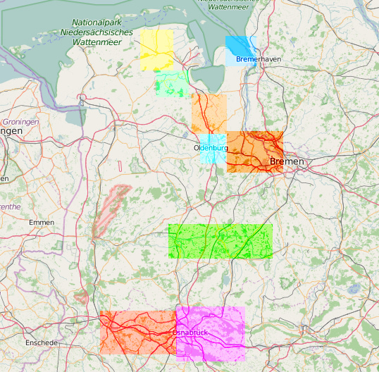
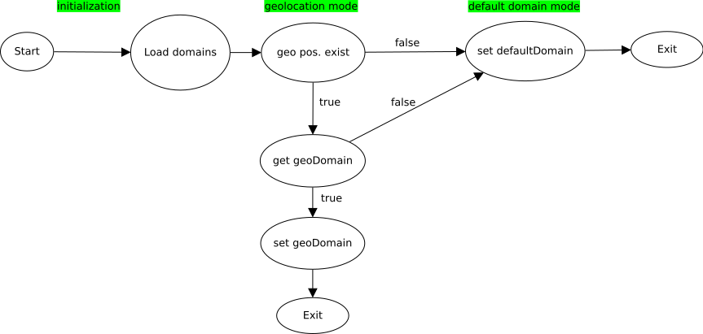
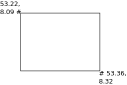

gluon-hoodselector
==================

This package provides an automatism of selecting the right hood network in an
intelligent way. This hood bases on geostationary fixed quadrants for
batman-adv mesh networks. The Hoodselector makes it possible to build scaled
decentralised mesh-networks.

Background informations
-----------------------

The main problem of the Nordwest Freifunk community was the quickly rising
number of nodes in the network. This indirectly affected the stability of the
network because the noise inside the network, e.g. management traffic from
the batman-adv protocol, was rising, too. Inside the community there were some
ideas like building separate firmwares for each region. This kind of solution
would have problems with splitting regions again and problems with scattered
nodes, which belong to an other region. Therefore we decided to develop a
dynamic and decentralised management of regions called hoods.
The Hoodselector's task is to choose the "right" hoods in an intelligent way
and to hold the network together and accessible.

A hood is defined by geostationary fixed shapes by using longitude & latitude
in combination with the domain configuration system. Below you can see a visual
example of regional hoods:

Hoodselector logic
------------------

The following is an abstract state diagramm which gives an overview
of the process:

The sequence of this diagramm is given the priority of running modes.
Each mode will be explained seperatedly below.

VPN-mode
^^^^^^^^

This mode will be entered only if a router can see batman-adv gateways over VPN.
Routers which have a VPN connection to a supernode will set their hood based on
their position if they have one. If a node has a position which is outside of
all defined shapes, it will set the default hood. If no position is set,
the node will continue with the next mode. The VPN mode will be entered first.
This way, the Hoodselector takes care of holding nodes around supernodes
to ensure that nodes can at least reach the autoupdate server.

Hood
----

A hood bases on the related domain configuration with some additional
configuration. There are two types of hoods: one without any defined shapes
which has to be unique and others which contain shapes.

* **default hood**

defaulthood: The default hood doesn’t have shapes and is the inverted form of
all other hoods with geo coordinates. It will be entered if no node matches to a
real hood. A suggested approach is to define the "old" network as default hood
and gradually migrate parts from there to shape defined hoods ("real hood").

* **real hood**

A real hood contains shapes, which are described by three dimensional arrays and
represents the geographical size of the real hood. There are two possible
definitions of these shapes. The first one is using rectangulars so that only
two coordinates per box are needed to reconstruct it (see below for an example).
The second one is using polygons which can have multible edges.
Each real hood can have multiple defined shapes.

site.conf
---------

The designer of the shapes should always ensure that no overlapping polygons
will be created!
Here is an example of a rectangular definition of a shape:
Example::

  hoodselector = {
    shapes = {
      {
        {
          lat = 53.128,
          lon = 8.187
        },
        {
          lat = 53.163,
          lon = 8.216
        },
      },
    },
  },

Here is an example of a trigon polygon defined shape:
Example::

  hoodselector = {
    shapes = {
      {
        {
          lat = 53.128,
          lon = 8.187
        },
        {
          lat = 53.163,
          lon = 8.216
        },
        {
          lat = 53.196,
          lon = 8.194
        },
      },
    },
  },

This package is incompatible with the :doc:`gluon-config-mode-domain-select`.
