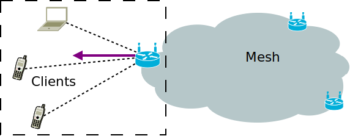
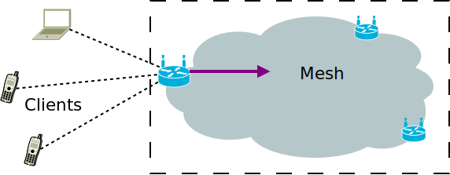
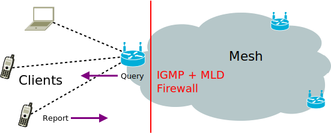

gluon-mesh-batman-adv
=====================

B.A.T.M.A.N. Advanced (often referenced as batman-adv) is an implementation of
the B.A.T.M.A.N. routing protocol in form of a linux kernel module operating on layer 2.

Layer 2 means that all client devices will operate in the same, virtual broadcast
domain and will see each other "as if they were connected to one giant switch".

This comes with a set of advantages (like quick and economical client device roaming,
layer 3 protocol agnosticism, broadcast/multicast). But also impediments, especially
layer 2 multicast overhead - which Gluon tries to mitigate to achieve a certain degree
of scalability. See :doc:`gluon-nftables-filter-multicast` and
:ref:`batman-adv-multicast-architecture` for details.

B.A.T.M.A.N. Advanced project homepage:

* https://www.open-mesh.org/projects/batman-adv/wiki/Wiki

B.A.T.M.A.N. Routing Algorithms
^^^^^^^^^^^^^^^^^^^^^^^^^^^^^^^

Two routing algorithms are selectable via
:ref:`site.conf mesh section <user-site-mesh>`: BATMAN_IV and BATMAN_V.

BATMAN_IV - stable
""""""""""""""""""

This is the recommended algorithm to use with `gluon-mesh-batman-adv-15`.

BATMAN_V - experimental
"""""""""""""""""""""""

This is the experimental B.A.T.M.A.N. routing algorithm. It is packet format /
compatibility stable but is still in development.

For more details, see:

* https://www.open-mesh.org/projects/batman-adv/wiki/BATMAN_V

.. _batman-adv-multicast-architecture:

Multicast Architecture
----------------------

.. image:: gluon-mesh-batman-adv-multicast.svg
  :width: 300 px

While generally broadcast capability is a nice feature of a layer 2
mesh protocol, it quickly reaches its limit.

For meshes with about **50 nodes / 100 clients, or more** it is therefore highly
recommended to add the :doc:`gluon-nftables-filter-multicast`
package. Also, with the *mesh-batman-adv-15* feature,
:doc:`gluon-nftables-limit-arp` is selected by default.

Furthermore, by default IGMP and MLD messages are filtered. See
:ref:`site.conf mesh section <user-site-mesh>` and
:ref:`igmp-mld-domain-segmentation` for details.

To achieve some level of scalability for multicast, multicast group
awareness is implemented and utilized in the following ways:

Node-Local Multicast Handling
^^^^^^^^^^^^^^^^^^^^^^^^^^^^^

A Gluon node sends IGMP/MLD Queries with the following parameters on its
local segment:

* Interval: 20 seconds
* Robustness: 9
* Query Response Interval: 5 seconds

This way, through the returning IGMP/MLD reports, the node learns which
multicast groups its clients are interested in.

This is then used to deliver multicast packets to its own Wifi clients
via individual Wifi unicast transmissions instead of a broadcast transmission.

The advantages of this are:

* Usually higher bitrates: Mostly lower airtime usage
* Acknowledged, retried transmissions (ARQ): Higher reliability
* If no local client is interested: Avoiding the transmission, no airtime usage

Notably multicast for IPv6 Neighbor Discovery usually has only a single
multicast listener in the case of address resolution and usually no
multicast listener for duplicate address detection. Which are the ideal
cases for multicast snooping / multicast to unicast.

The unicast delivery is achieved through utilizing the multicast-to-unicast
feature in OpenWrt/netifd. Which in turn utilizes the multicast-to-unicast
conversion and hairpin features of the Linux bridge, plus the hostapd client
isolation feature, to hand over full delivery control to the bridge.

Mesh-wide Multicast Handling
^^^^^^^^^^^^^^^^^^^^^^^^^^^^

To be able to avoid transmissions not only on the "last mile", the AP interface
to the local clients, but also from the "last mile" into the mesh in the future
multicast listener state is propagated through the mesh:

batman-adv (compat 15) taps into the Linux bridge and inherits the multicast
groups into its translation table. Which then takes care of efficiently
distributing this knowledge to other nodes.

While by that the receiver side is ready to go, the sender part in batman-adv
is disabled for now in Gluon. It will be enabled in a future release.

.. _igmp-mld-domain-segmentation:

IGMP/MLD Domain Segmentation
^^^^^^^^^^^^^^^^^^^^^^^^^^^^

Internet Group Membership Protocol and Multicast Listener Discovery Protocol
are the standardized network protocols to query, report and learn multicast
group memberships on the local link for IPv4 (IGMP) and IPv6 (MLD).

By default Gluon filters IGMP and MLD queries and reports towards the mesh
and runs an IGMP/MLD querier on each node for its own local clients.
Furthermore Gluon tags the mesh side bridge port (bat0) as a multicast
router port.

That way, even though the Linux client bridge in Gluon is unable to learn
about multicast memberships behind other nodes, the multicast router port
flag will force it to unconditionally hand over all multicast packets to
batman-adv. Which even with IGMP/MLD filtered, will have full multicast
membership knowledge through its own propagation through the batman-adv
translation table.

Advantages are:

* Reduced overhead through reactive batman-adv multicast TT vs.
  periodic IGMP/MLD messages in the mesh
* Increased IGMP/MLD snooping robustness via local, per node
  IGMP/MLD queriers
* DDoS vector mitigation

**Note:** For nodes running an operating system other than Gluon, but a bridge
interface on top of the batman-adv interface, you will need to set the
multicast router flag there manually:

``debian$ echo 2 > /sys/class/net/bat0/brport/multicast_router``

"2" for this parameter means to always assume a multicast router behind
this bridge port and to therefore forward all multicast packets to this
port. Versus the default of "1" which means to learn about multicast
routers via IGMP/MLD Queries, PIM and MRD messages; or "0" to always
assume that there is no multicast router behind this port, meaning
to only forward multicast to this port if an according multicast
listener on this link was detected.

Further limitations: IGMP/MLD snooping switches (e.g. "enterprise switches")
behind the client network of a node (LAN ports) are unsupported. It is
advised to disable IGMP/MLD snooping on those enterprise switches for now
or to at least manually mark the port to the Gluon router as a
"multicast router port".

Alternatively, the filtering of IGMP/MLD reports can be disabled via
the site.conf (which is not recommended in large meshes though).
See :ref:`site.conf mesh section <user-site-mesh>` for details.
