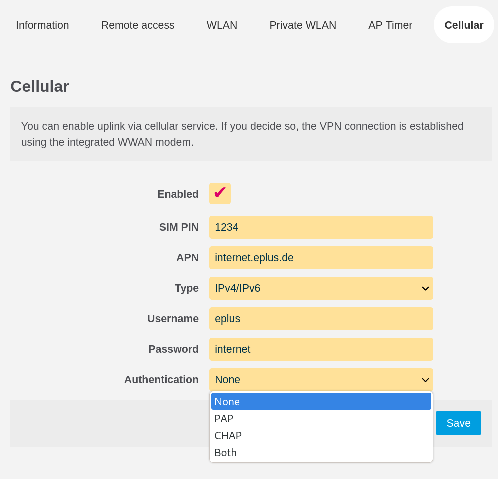

.. _package-gluon-web-cellular:

gluon-web-cellular
==================

This package allows to configure WWAN for capable cellular devices.

This works by creating an abstraction layer into Gluon which takes common options (SIM PIN / APN) and translates it to modem-specific settings based on the specific device using. 
Doing so limits the use-case onto specific models (no LTE sticks possible) but provides a common interface.

The WWAN is assigned the WAN firewall zone and wired WAN can still be used, however without prioritization.
The traffic path is not configured to prefer one uplink source or the other.

