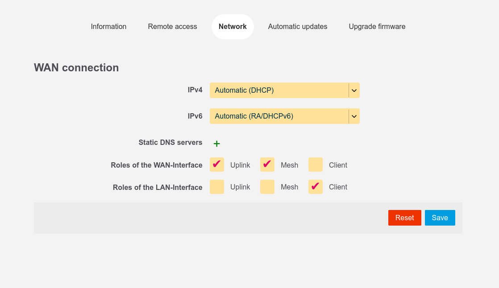

gluon-web-network
=================

The package *gluon-web-network* is part of :ref:`Feature Flag <user-site-feature-flags>` web-advanced.
It allows to configure the network interfaces roles of the gluon node in config mode through checkboxes.

It is a user-friendly way to configure what otherwise would need the :ref:`wired-mesh-commandline`.

configuration options
---------------------

The following roles can be assigned to the interfaces:
* `Uplink` - interface is used for WAN connection, which is used for the VPN if `mesh-vpn` checkbox is enabled in basic config mode
* `Mesh` - interface is used for :doc:`../features/wired-mesh`. Using this on the WAN interface is also known as "Mesh-on-WAN"
* `Client` - interface is used as client network - connected devices to this interface should get a working internet configuration through DHCP

The roles `Uplink`/`Mesh` and `Client` are mutually exclusive.
