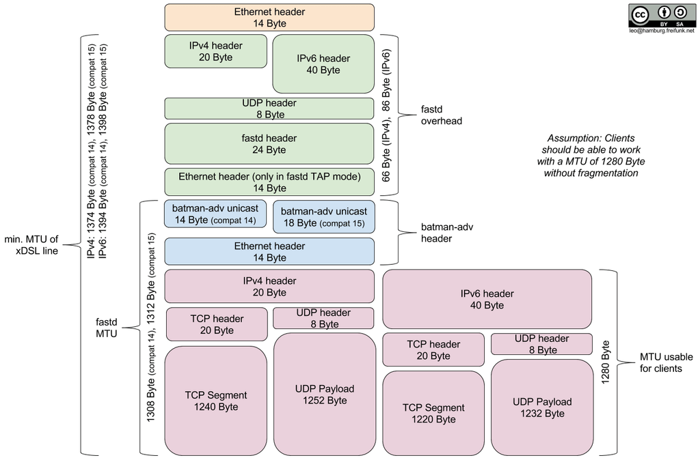

Frequently Asked Questions
==========================

.. _faq-dns:

DNS does not work on the nodes
~~~~~~~~~~~~~~~~~~~~~~~~~~~~~~

Gluon nodes will ignore the DNS server on the WAN port for everything except
the mesh VPN, which can lead to confusion.

All normal services on the nodes exclusively use the DNS server on the mesh
interface. This DNS server must be announced in router advertisements (using
*radvd* or a similar software) from one or more central servers in meshes based
on *batman-adv*. If your mesh does not have global IPv6 connectivity, you can setup
your *radvd* not to announce a default route by setting the *default lifetime* to 0;
in this case, the *radvd* is only used to announce the DNS server.

.. _faq-mtu:

What is a good MTU on the mesh-vpn
~~~~~~~~~~~~~~~~~~~~~~~~~~~~~~~~~~

Setting the MTU on the transport interface requires careful consideration, as
setting it too low will cause excessive fragmentation and setting it too high
may leave peers with a broken tunnel due to packet loss.

Consider these key values:

- Payload: Allow for the transport of IPv6 packets, by adhering to the minimum MTU
  of 1280 Byte specified in RFC 2460
  - and configure `MSS clamping`_ accordingly,
  - and announce your link MTU via Router Advertisements and DHCP

  .. _MSS clamping: https://www.tldp.org/HOWTO/Adv-Routing-HOWTO/lartc.cookbook.mtu-mss.html

- Encapsulation: Account for the overhead created by the configured mesh protocol
  encapsulating the payload, which is
  - up to 32 Byte (14 Byte Ethernet + 18 Byte batadv) for batman-adv compat v15 (v2014.0 and later)
  - up to 28 Byte (14 Byte Ethernet + 14 Byte batadv) for batman-adv compat v14 (v2011.3.0 until and including v2013.4.0)

- PMTU: What MTU does the path between your gateway and each of its peers support?

For reference, the complete MTU stack looks like this:

Minimum MTU
-----------

Calculate the minimum transport MTU by adding the encapsulation overhead to the
minimum payload MTU required. This is the lowest recommended value, since going
lower would cause unnecessary fragmentation for clients which respect the announced
link MTU.

Example: Our network currently uses batman-adv v15, it therefore requires up
to 32 Bytes of encapsulation overhead on top of the minimal link MTU required for
transporting IPv6.::

  \        1312              1294          1280                                 0
   \---------+-----------------+-------------+----------------------------------+
    \TAP     |    batadv v15   |   Ethernet  |            Payload               |
     \-------+-----------------+-------------+----------------------------------+
      \      ^
             |

          MTU_LOW = 1280 Byte + 14 Byte + 18 Byte = 1312 Byte

Maximum MTU
-----------

Calculating the maximum transport MTU is interesting, because it increases the
throughput, by allowing larger payloads to be transported, but also more difficult
as you have to take into account the tunneling overhead and each peers PMTU, which
varies between providers.
The underlying reasons are mostly PPPoE, Tunneling and IPv6 transition technologies
like DS-Lite.

Example: The peer with the smallest MTU on your network is behind DS-Lite and can
transport IPv4 packets up to 1436 Bytes in size. Your tunnel uses IPv4 (20 Byte),
UDP (8 Byte), Fastd (24 byte) and you require TAP (14 Byte) for Layer 2 (Ethernet)
Tunneling.::

  1436                1416     1408                    1384          1370    \
    +-------------------+--------+-----------------------+-------------+------\
    |        IP         |  UDP   |         Fastd         |     TAP     |    bat\
    +-------------------+--------+-----------------------+-------------+--------\
                                                                       ^         \
                                                                       |

       MTU_HIGH = 1436 Byte - 20 Byte - 8 Byte - 24 Byte - 14 Byte = 1370 Byte

Conclusion
----------

Determining the maximum MTU can be a tedious process, especially since the PMTU
of peers could change at any time. The general recommendation for maximized
compatibility is therefore the minimum MTU of 1312 Byte, which works well with
all combinations of IPv4, IPv6, batman-adv compat v14 and v15.
