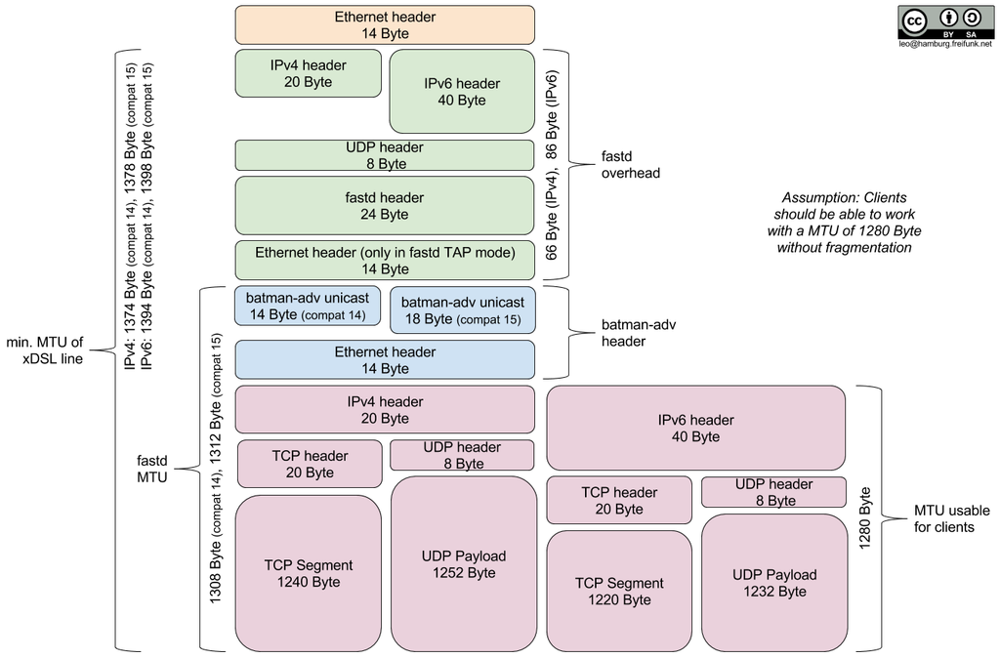

.. _mtu:

MTU for Mesh-VPN
================

What is a good MTU on the mesh-vpn?
~~~~~~~~~~~~~~~~~~~~~~~~~~~~~~~~~~~

Setting the MTU on the transport interface requires careful consideration, as
setting it too low will cause excessive fragmentation and setting it too high
may leave peers with a broken tunnel due to packet loss.

Consider these key values:

- Payload: Allow for the transport of IPv6 packets, by adhering to the minimum MTU
  of 1280 Byte specified in RFC 2460
  - and configure `MSS clamping`_ accordingly,
  - and announce your link MTU via Router Advertisements and DHCP

  .. _MSS clamping: https://tldp.org/HOWTO/Adv-Routing-HOWTO/lartc.cookbook.mtu-mss.html

- Encapsulation: Account for the overhead created by the configured mesh protocol
  encapsulating the payload, which is up to 32 Byte (14 Byte Ethernet + 18 Byte
  batman-adv).

- PMTU: What MTU does the path between your gateway and each of its peers support?

For reference, the complete MTU stack looks like this:

Example for Minimum MTU
-----------------------

Calculate the minimum transport MTU by adding the encapsulation overhead to the
minimum payload MTU required. This is the lowest recommended value, since going
lower would cause unnecessary fragmentation for clients which respect the announced
link MTU.

.. editorconfig-checker-disable

Example: Our network currently uses batman-adv v15, it therefore requires up
to 32 Bytes of encapsulation overhead on top of the minimal link MTU required for
transporting IPv6.::

  \        1312              1294          1280                                 0
   \---------+-----------------+-------------+----------------------------------+
    \TAP     |  batman-adv v15 |   Ethernet  |            Payload               |
     \-------+-----------------+-------------+----------------------------------+
      \      ^
             |

          MTU_LOW = 1280 Byte + 14 Byte + 18 Byte = 1312 Byte

Example for Maximum MTU
-----------------------

Calculating the maximum transport MTU is interesting, because it increases the
throughput, by allowing larger payloads to be transported, but also more difficult
as you have to take into account the tunneling overhead and each peers PMTU, which
varies between providers.
The underlying reasons are mostly PPPoE, tunneling and IPv6 transition technologies
like DS-Lite.

Example: The peer with the smallest MTU on your network is behind DS-Lite and can
transport IPv4 packets up to 1436 Bytes in size. Your tunnel uses IPv4 (20 Byte),
UDP (8 Byte), Fastd (24 byte) and you require TAP (14 Byte) for Layer 2 (Ethernet)
tunneling.::

  1436                1416     1408                    1384          1370    \
    +-------------------+--------+-----------------------+-------------+------\
    |        IP         |  UDP   |         Fastd         |     TAP     |    bat\
    +-------------------+--------+-----------------------+-------------+--------\
                                                                       ^         \
                                                                       |

       MTU_HIGH = 1436 Byte - 20 Byte - 8 Byte - 24 Byte - 14 Byte = 1370 Byte

.. editorconfig-checker-enable

Tables for Different VPN Providers
----------------------------------

VPN Protocol Overhead (IPv4)
^^^^^^^^^^^^^^^^^^^^^^^^^^^^

Overhead of the VPN protocol layers in bytes on top of an Ethernet frame.

+----------+-------+-----------+
|          | fastd | WireGuard |
+==========+=======+===========+
| IPv4     | 20    | 20        |
+----------+-------+-----------+
| UDP      | 8     | 8         |
+----------+-------+-----------+
| Protocol | 24    | 32        |
+----------+-------+-----------+
| TAP      | 14    | /         |
+----------+-------+-----------+
| Sum      | 66    | 60        |
+----------+-------+-----------+

Intermediate Layer Overhead
^^^^^^^^^^^^^^^^^^^^^^^^^^^

Overhead of additional layers on top of the VPN packet needed for different VPN
providers.

+------------+-------+-----------+
|            | fastd | WireGuard |
+============+=======+===========+
| IPv6       | /     | 40        |
+------------+-------+-----------+
| vxlan      | /     | 16        |
+------------+-------+-----------+
| Ethernet   | /     | 14        |
+------------+-------+-----------+
| Batman v15 | 18    | 18        |
+------------+-------+-----------+
| Ethernet   | 14    | 14        |
+------------+-------+-----------+
| Sum        | 32    | 102       |
+------------+-------+-----------+

Minimum MTU
^^^^^^^^^^^

Calculation of different derived MTUs based on a 1280 byte payload to
avoid fragmentation.

Suggestions:

- This configuration is only suggested for fastd.

- For WireGuard, this configuration is **unsuitable**. To obtain a 1280 byte
  payload with our protocol stack (see below), the Ethernet frame payload would
  be 1442 bytes long (for IPv4). As we assume that the WAN network might have
  a (worst case) MTU of only 1436 (with DSLite), this packet would be too long
  for the WAN network.

+-------------------------------+-------+-----------+
|                               | fastd | WireGuard |
+===============================+=======+===========+
| max unfragmented payload\*    | 1280  | 1280      |
+-------------------------------+-------+-----------+
| intermediate layer overhead   | 32    | 102       |
+-------------------------------+-------+-----------+
| VPN MTU\*\*                   | 1312  | 1382      |
+-------------------------------+-------+-----------+
| protocol overhead (IPv4)      | 66    | 60        |
+-------------------------------+-------+-----------+
| min acceptable WAN MTU (IPv4) | 1378  | **1442**  |
+-------------------------------+-------+-----------+
| min acceptable WAN MTU (IPv6) | 1398  | 1462      |
+-------------------------------+-------+-----------+

\* Maximum size of payload going into the bat0 interface, that will not be
fragmented by batman.

\*\* This is the MTU that is set in the site.conf.

Maximum MTU
^^^^^^^^^^^

Calculation of different derived MTUs based on a maximum WAN MTU of 1436.

Suggestions:

- This configuration can be used for fastd.

- For WireGuard, this is the recommended configuration. batman-adv will
  fragment larger packets transparently to avoid packet loss.

+-------------------------------+-------+-----------+
|                               | fastd | WireGuard |
+===============================+=======+===========+
| min acceptable WAN MTU (IPv4) | 1436  | 1436      |
+-------------------------------+-------+-----------+
| protocol overhead (IPv4)      | 66    | 60        |
+-------------------------------+-------+-----------+
| VPN MTU\*\*                   | 1370  | 1376      |
+-------------------------------+-------+-----------+
| intermediate layer overhead   | 32    | 102       |
+-------------------------------+-------+-----------+
| max unfragmented payload\*    | 1338  | 1274      |
+-------------------------------+-------+-----------+
| min acceptable WAN MTU (IPv6) | 1398  | 1462      |
+-------------------------------+-------+-----------+

\* Maximum size of payload going into the bat0 interface, that will not be
fragmented by batman.

\*\* This is the MTU that is set in the site.conf.

Suggested MSS Values
^^^^^^^^^^^^^^^^^^^^

It is highly advised to use MSS clamping for TCP on the gateways/supernodes in
order to avoid the fragmentation mechanism of batman whenever possible.
Especially on small embedded devices, fragmentation costs performance.

As batmans fragmentation is transparent to the TCP layer, clamping the MSS
automatically to the PMTU does not work. Instead, the MSS must be specified
explicitly. In iptables, this is done via :code:`-j TCPMSS --set-mss X`,
whereby :code:`X` is the desired MSS.

Since the MSS is specified in terms of payload of a TCP packet, the MSS is
different for IPv4 and IPv6. Here are some examples for different max
unfragmented payloads:

+---------------------------------+------+------+------+------+
| max unfragmented payload        | 1274 | 1280 | 1338 | 1354 |
+=================================+======+======+======+======+
| suggested MSS (IPv4, -40 bytes) | 1234 | 1240 | 1298 | 1314 |
+---------------------------------+------+------+------+------+
| suggested MSS (IPv6, -60 bytes) | 1214 | 1220 | 1278 | 1294 |
+---------------------------------+------+------+------+------+

Conclusion
^^^^^^^^^^

Determining the maximum MTU can be a tedious process, especially since the PMTU
of peers could change at any time. The general recommendation for maximized
compatibility is therefore an MTU of 1312 bytes for fastd
and 1376 bytes for WireGuard.
